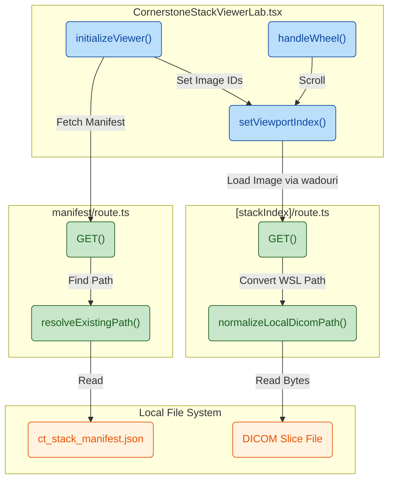

## 1. High-Level Summary (TL;DR)

- **Impact:** [Medium] - 引入了独立的 CT 影像浏览实验室（Viewer Lab），支持通过本地 API 直接加载并渲染 DICOM 序列，无需依赖 Orthanc 或 OHIF 等外部服务。
- **Key Changes:**
  - ✨ **新增 Viewer Lab 页面与组件**：实现了基于 `Cornerstone3D` 的医学影像视口（Viewport），支持通过鼠标滚轮、控制按钮和滑块来流畅切换 CT 切片。
  - 🔌 **新增本地 DICOM API 路由**：添加了读取本地 `manifest` 配置文件和单张 DICOM 文件的 Next.js API，并内置了对 WSL 路径（如 `/mnt/e/`）向 Windows 盘符路径的转换逻辑。
  - 📦 **引入 Cornerstone 相关依赖**：项目中集成了 `@cornerstonejs` 核心库及相关工具，并调整了 Webpack 配置以兼容前端 Node.js 模块。
  - 🎨 **全局样式更新**：为 Viewer Lab 增加了专属的网格布局、深色模式视口以及元数据展示的 CSS 样式。

## 2. Visual Overview (Code & Logic Map)

以下展示了前端影像视口如何与本地 API 交互以读取本地系统中的 DICOM 文件：

## 3. Detailed Change Analysis

### 📦 项目配置与依赖更新 (Dependencies & Config)

**What Changed:** 引入了 Cornerstone3D 系列工具来支持浏览器端的医学影像渲染。为了防止浏览器端打包时因为引入 `dicom-parser` 找不到 Node.js 原生模块而报错，修改了 `next.config.ts`。

| Package / Config                    | Old Value / Version | New Value / Version | Description                        |
| :---------------------------------- | :------------------ | :------------------ | :--------------------------------- |
| `@cornerstonejs/core`               | -                   | `^4.22.4`           | Cornerstone3D 核心渲染引擎         |
| `@cornerstonejs/dicom-image-loader` | -                   | `^4.22.4`           | DICOM 图像解析加载器               |
| `@cornerstonejs/tools`              | -                   | `^4.22.4`           | 影像交互工具（如缩放、平移等）     |
| `dicom-parser`                      | -                   | `^1.8.21`           | DICOM 文件底层解析库               |
| `resolve.fallback.fs`               | -                   | `false`             | Webpack 配置：禁用前端的 fs 模块   |
| `resolve.fallback.path`             | -                   | `false`             | Webpack 配置：禁用前端的 path 模块 |

### 🔌 本地 DICOM API 路由 (API Endpoints)

**What Changed:**
新增了两个只在 Node.js 环境（`runtime = "nodejs"`）下运行的强制动态（`force-dynamic`） API，专门用于访问本地硬盘中的 DICOM 测试数据。

- **Manifest 获取逻辑**：读取 `ct_stack_manifest.json`，其中包含了 CT 切片列表及其元信息。
- **路径转换逻辑**：`normalizeLocalDicomPath()` 方法自动将 WSL 生成的路径（如 `/mnt/e/` 或 `/mnt/d/`）转换为 Windows 格式（`E:/`、`D:/`），以兼容在 PowerShell 下运行的 Next.js 服务。

| API Route                                | Method | Description                                                                                                                              |
| :--------------------------------------- | :----- | :--------------------------------------------------------------------------------------------------------------------------------------- |
| `/api/dicom/local/[caseId]/manifest`     | GET    | 查找并返回指定 `caseId` 的 CT 影像堆栈 JSON 配置信息。                                                                                   |
| `/api/dicom/local/[caseId]/[stackIndex]` | GET    | 根据 `stackIndex` 定位具体的 DICOM 文件，并以 `application/dicom` 类型返回二进制数据流，同时通过 Response Header 暴露 SOP UID 等元数据。 |

### 🖥️ 影像视口前端组件 (UI Components)

**What Changed:**
新增了 `CornerstoneStackViewerLab.tsx` 组件，这是整个功能的视图核心。

- **引擎初始化**：使用 `useEffect` 挂载 `RenderingEngine` 并初始化 `dicomImageLoader`，同时配置单 Web Worker 限制以优化性能。
- **交互控制**：实现了 `setViewportIndex()` 方法，用户可以通过 `handleWheel` (鼠标滚轮)、按键或 `<input type="range">` 滑块来变更当前的切片索引。
- **状态管理**：使用 `idle` -> `loading-manifest` -> `initializing-viewer` -> `ready` / `error` 的状态机来控制 UI 遮罩层及错误提示的展示。

## 4. Impact & Risk Assessment

- ⚠️ **本地路径硬编码风险 (Hardcoded Paths):** 在 API 路由中硬编码了特定的本地和 WSL 路径（例如 `E:/med_data/ct_demo/derived/lidc_case_002/...`）。在未配置对应路径或缺少测试数据的开发机上运行时，必定会导致 404 错误。**建议后续将基础路径提取为环境变量（Environment Variable）**。
- 🐛 **热更新竞态条件 (HMR Race Conditions):** `Cornerstone3D` 的渲染引擎在开发模式下的 React Strict Mode 热更新中可能存在卸载/重新挂载冲突。虽然代码中已加入了 `try-catch` 捕获 `renderingEngineRef.current?.destroy?.()` 异常，但仍需留意偶发性 WebGL 崩溃。
- **Breaking Changes:** 无破坏性变更，此改动是一个完全独立的新增功能模块。
- **Testing Suggestions:**
  - **异常流测试**：删除或重命名本地的 `ct_stack_manifest.json`，验证前端是否能够正确捕获错误并展示 "Viewer initialization failed" 状态。
  - **边界值测试**：测试拖动滑块至第 `0` 张和最后一张（`maxIndex`）时，前后按钮的 `disabled` 状态是否正常。
  - **跨平台路径测试**：如果有条件，验证在纯 Windows 环境和纯 Linux (WSL) 环境下，DICOM 图像文件的读取路径是否都能被正确解析。
