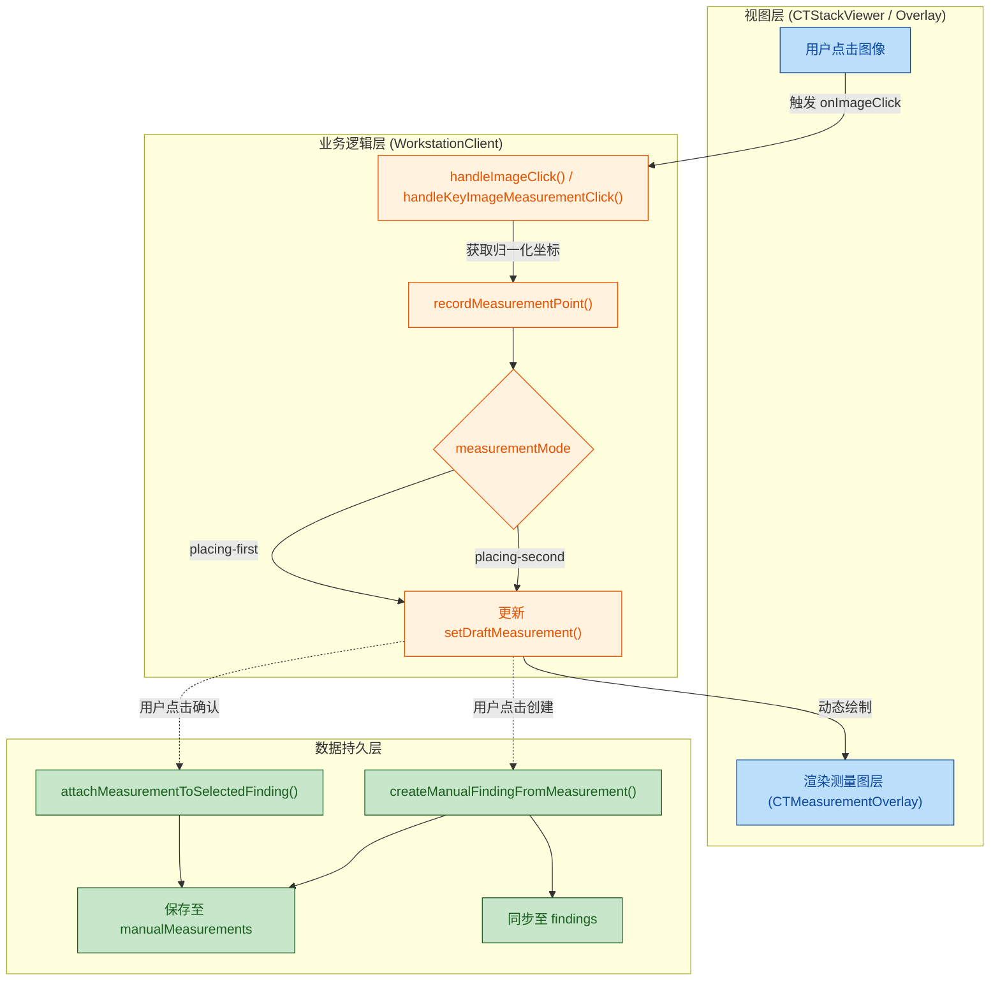

## 1. High-Level Summary (TL;DR)

- **Impact:** High - 引入了在 CT 图像上进行手动两点距离测量的核心交互功能，极大增强了工作站的病灶手动标注能力。
- **Key Changes:**
  - 新增 `CTMeasurementOverlay` 组件，支持在 CT 图像上渲染测量线、控制点和距离标签。
  - 在 `WorkstationClient` 中实现了完整的测量状态机（从点击第一个点到完成测量的流程）。
  - 新增将手动测量结果绑定到已有病灶（Finding）或直接创建新手动的病灶的操作逻辑。
  - 升级 `CTStackViewer` 以捕获图像点击坐标并传递给上层业务组件。
  - 添加了相关的 CSS 样式，包括测量激活时的十字准星光标（crosshair）以及测量工具栏的 UI 样式。

## 2. Visual Overview (Code & Logic Map)

## 3. Detailed Change Analysis

### `components/ct/CTMeasurementOverlay.tsx` (全新组件)

- **What Changed:** 新增的视图组件，负责将测量的归一化坐标（0~1）映射为 DOM 实际坐标，并利用 `<svg>` 绘制两点之间的连线，以及利用绝对定位显示测量的端点和距离文本标签。
- **核心方法:** `getNormalizedImagePoint()` 用于计算鼠标点击在图像可视区域内的相对比例位置，从而实现与分辨率和缩放无关的坐标存储。

### `components/WorkstationClient.tsx` (核心业务逻辑)

- **What Changed:** 注入了测量系统的状态管理和业务行为。通过计算物理像素间距 (`pixelSpacing`) 将两点间的像素距离转化为真实的物理距离（毫米）。支持不同层面的切片校验，防止跨切片（Cross-slice）完成同一个测量。

| 状态变量             | 类型                                                          | 描述                                       |
| -------------------- | ------------------------------------------------------------- | ------------------------------------------ |
| `measurementMode`    | `"idle" \| "placing-first" \| "placing-second" \| "complete"` | 跟踪当前测量的交互阶段                     |
| `draftMeasurement`   | `DraftMeasurement \| null`                                    | 存储当前正在绘制中但尚未保存的草稿测量数据 |
| `manualMeasurements` | `ManualMeasurement[]`                                         | 存储已成功绑定或创建的所有手动测量数据     |

### `components/ct/CTStackViewer.tsx` (底层视图适配)

- **What Changed:** 增加了 `onImageClick` 回调属性和对应的内部鼠标点击处理函数 `handleImageClick`。在组件内部引入并挂载了 `CTMeasurementOverlay`，同时在测量激活时为外层容器附加 `.measurement-active` 类。

### `app/globals.css` (样式调整)

- **What Changed:** 新增了用于测量的各类样式，包括面板布局（`.measurement-tool-panel`）、按钮样式和激活状态下的鼠标指针变更为十字准星（`cursor: crosshair;`）。同时添加了用于删除病灶按钮的样式 `.finding-delete-button`。

## 4. Impact & Risk Assessment

- **🐛 Breaking Changes:** 无。这是一个纯新增的增强功能，没有修改现有的核心读图逻辑。
- **⚠️ 测试建议 (Testing Suggestions):**
  1.  **坐标转换测试:** 改变浏览器窗口大小（Resize）或切换不同长宽比的显示器，验证鼠标点击生成的点是否依然精准贴合在 CT 图像的预期位置。
  2.  **跨切片校验:** 在放置第一点后，滚动鼠标滚轮切换到另一张 CT 切片并尝试放置第二点，验证系统是否正确给出了“请返回原切片”的提示（`sameSlice` 逻辑）。
  3.  **状态绑定:** 将测量附加到一个已经被 "dismissed"（忽略）的病灶上，检查 UI 提示和拦截逻辑是否正常生效。
  4.  **数据流闭环:** 验证点击 `createManualFindingFromMeasurement` 后，新的 Finding 是否出现在左侧列表，且计算出的毫米级长度是否被正确带入报告上下文中。
