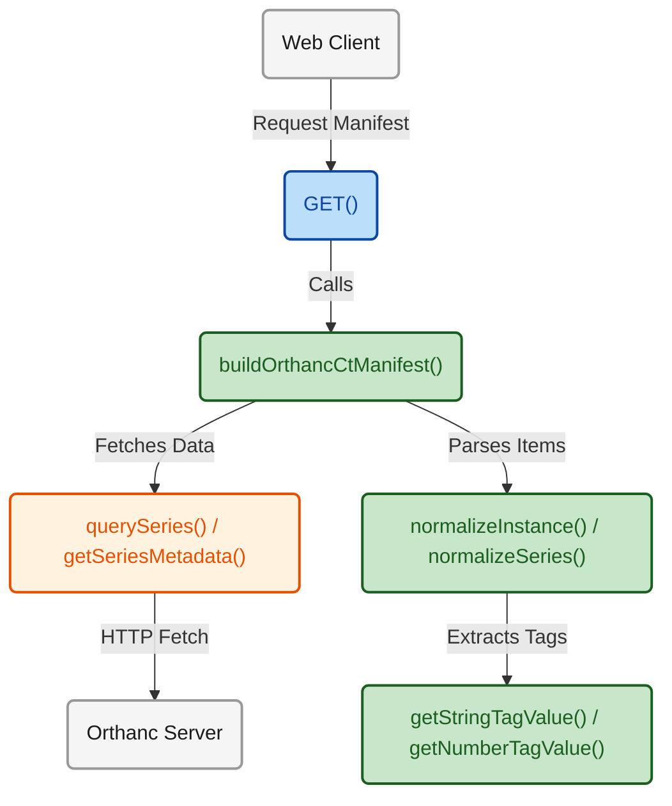

## 1. High-Level Summary (TL;DR)

- **Impact:** [Medium] - 引入了与 Orthanc DICOMweb 服务器进行交互的核心模块及对应的 API 接口，奠定了影像数据获取的基础设施。
- **Key Changes:**
  - 新增了 **Orthanc HTTP 客户端** (`orthancClient.ts`)，支持 Basic Auth 鉴权及各类 DICOMweb 数据查询。
  - 实现了 **DICOM 标签解析与提取工具** (`dicomTags.ts`)。
  - 新增了 **数据归一化逻辑** (`normalize.ts`)，用于提取 DICOM 数据并生成标准的 CT 影像清单 (Manifest)。
  - 新增了一个 **API 路由** (`route.ts`)，专用于为特定病例 (`lidc-case-002`) 提供数据访问服务，并包含了完善的错误处理。
  - 在 `.env.example` 中增加了 Orthanc 相关的环境变量配置。

## 2. Visual Overview (Code & Logic Map)

## 3. Detailed Change Analysis

### API Endpoints

新增用于获取 `lidc-case-002` 病例 CT 数据清单的 API。

- **What Changed:** 在 `app/api/dicomweb/lidc-case-002/manifest/route.ts` 中新增了 `GET()` 接口。该接口负责调用底层的 `buildOrthancCtManifest()` 并实现对 Orthanc 服务连接拒绝、元数据缺失、序列未找到等情况的异常捕获与细粒度状态码返回 (如 502, 503, 404)。

### DICOM Core & Utilities

解析并标准化 DICOM 格式数据以供前端或下游使用。

- **What Changed:**
  - 在 `lib/dicomweb/dicomTags.ts` 中定义了常用 DICOM 标签映射表 `DICOM_TAGS`，并实现了安全提取和拆箱值的函数（例如 `getStringTagValue()`, `getNumberTagValue()`）。
  - 在 `lib/dicomweb/normalize.ts` 中封装了将原始 DICOMweb 数据集转换为应用内部对象（`DicomWebSeriesSummary`, `DicomWebInstanceSummary`）的逻辑。重点实现了根据 Z 轴坐标或 Instance Number 对切片进行排序的功能。

### External Services Integration (Orthanc)

实现与 Orthanc 影像服务器通信的客户端。

- **What Changed:** 在 `lib/dicomweb/orthancClient.ts` 中实现了带有 Basic Authentication 头的 `orthancFetchJson()` 核心客户端。封装了针对 `/dicom-web/studies` 及相关 metadata/instances 路径的查询接口。

### Configuration & Environment

| Key                | Old Value | New Value               | Description        |
| ------------------ | --------- | ----------------------- | ------------------ |
| `ORTHANC_BASE_URL` | -         | `http://localhost:8042` | Orthanc 服务的地址 |
| `ORTHANC_USERNAME` | -         | `orthanc`               | API 认证用户名     |
| `ORTHANC_PASSWORD` | -         | `orthanc`               | API 认证密码       |

## 4. Impact & Risk Assessment

- **Breaking Changes:** ⚠️ 无（均为纯新增的后端模块与路由，不影响现有逻辑）。
- **Testing Suggestions:**
  - **服务中断测试:** 在未启动 Orthanc 容器的环境下访问 API，验证是否返回友好的 `503 Service Unavailable` 及 Docker 启动提示。
  - **环境变量兜底:** 验证在不配置 `.env` 的情况下，系统是否能正常使用 `localhost:8042` 与默认 `orthanc` 账号密码进行通信。
  - **数据排序准确性:** 针对不同的影像集，验证 `normalize.ts` 中的 `sortInstances()` 方法是否能正确依据 `zPosition` 提取并对 DICOM 实例完成排序。
