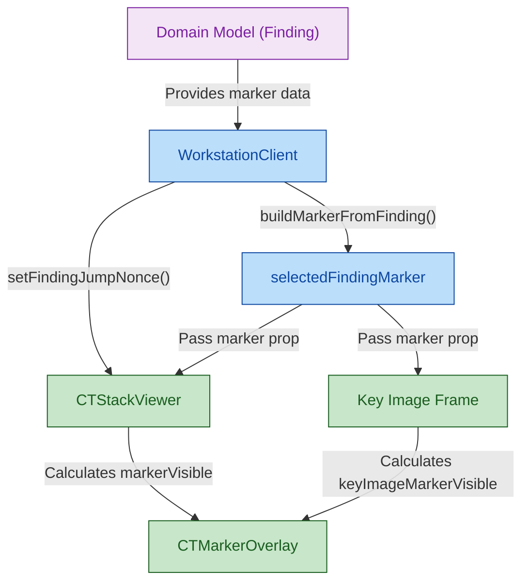

## 1. High-Level Summary (TL;DR)

- **Impact:** [Medium] - ✨ 引入了全新的 CT 影像标记覆盖层功能，支持在关键图像和 CT 序列视图中直观地高亮显示病灶位置。
- **Key Changes:**
  - 新增了 `CTMarkerOverlay` React 组件及对应的 CSS 样式，用于渲染不同形状和状态的病灶标记。
  - 扩展了领域模型 `Finding`，增加了基于坐标的 `marker` 数据结构，并更新了 Mock 数据。
  - 在 `WorkstationClient` 中增加了选中病灶时自动跳转到关联关键图像的交互逻辑。
  - 通过 `findingJumpNonce` 状态强制 `CTStackViewer` 在重复点击同一病灶时进行视图刷新。

## 2. Visual Overview (Code & Logic Map)

## 3. Detailed Change Analysis

### Domain & Mock Data

- **What Changed:** 扩展了底层的领域模型以支持空间标记。`Finding` 接口现在支持携带相对坐标 (x, y)、形状和标签。同时在 `lib/mock/data.ts` 中为测试数据注入了相关的模拟坐标。

| 实体/类型            | 变更内容          | 数据类型               | 描述                                                       |
| -------------------- | ----------------- | ---------------------- | ---------------------------------------------------------- |
| `Finding`            | 新增属性 `marker` | `FindingMarker` (可选) | 关联该病灶的空间坐标和形状标记信息。                       |
| `FindingMarker`      | 新增接口          | Interface              | 包含 `x`, `y`, `radius`, `shape`, `label` 等核心坐标字段。 |
| `FindingMarkerShape` | 新增类型          | Type                   | 定义支持的形状：`"crosshair"`, `"circle"`, `"box"`。       |

### `CTMarkerOverlay` 组件与样式

- **What Changed:** 创建了全新的覆盖层组件 (Source: `components/ct/CTMarkerOverlay.tsx`)。该组件使用 `ResizeObserver` 动态监听容器大小变化，并将相对坐标 (0~1) 映射为绝对的像素显示位置 `calculateDisplayPosition()`。同时在 `globals.css` 中添加了大量的标记样式，支持不同的状态（检测到、已确认、已忽略）及视觉形状定制。

### `WorkstationClient` (工作站客户端)

- **What Changed:**
  - 引入了 `buildMarkerFromFinding()` 将 `Finding` 数据转换为视图层需要的 `CTMarkerOverlayMarker` 对象。
  - 优化了交互逻辑：当用户选择一个病灶时，如果当前处于 `"key-images"` 模式，会自动查找并选中该病灶对应的关键图像切片。
  - 引入了 `findingJumpNonce` 机制，将其拼接到传递给序列视图的 `targetSliceKey` 中 (`${selectedFindingId}:${findingJumpNonce}`)，确保即使连续点击同一个病灶，组件也能监听到 key 的变化并触发切片跳转。

### `CTStackViewer` (CT 序列视图)

- **What Changed:** 集成了 `CTMarkerOverlay` 组件。内部增加了标记可见性的计算逻辑，只有当当前浏览的切片索引 (`currentSlice.instanceNumber` 或 `sliceIndex`) 与标记绑定的 `linkedSliceIndex` 匹配时，才将 `markerVisible` 设为 `true`，从而精准控制标记的显示时机。

## 4. Impact & Risk Assessment

- **Breaking Changes:** ⚠️ 无。`marker` 属性被设计为可选字段，完全向后兼容现有的 `Finding` 数据结构。
- **Testing Suggestions:**
  - **响应式测试：** 动态调整浏览器窗口或面板大小，验证 `CTMarkerOverlay` 中的标记位置是否能利用 `ResizeObserver` 正确缩放和重定位，且不发生偏移。
  - **视图同步跳转测试：** 点击病灶列表中的项，验证 "关键图像" 视图和 "完整序列" 视图是否能准确跳转到带有标记的切片并成功渲染出 `box` 或 `circle`。
  - **切片滚动测试：** 在 `CTStackViewer` 中滚动鼠标滚轮翻阅切片，确保标记只在对应的 `linkedSliceIndex` 层级显示，在滚动到相邻层级时自动隐藏。
