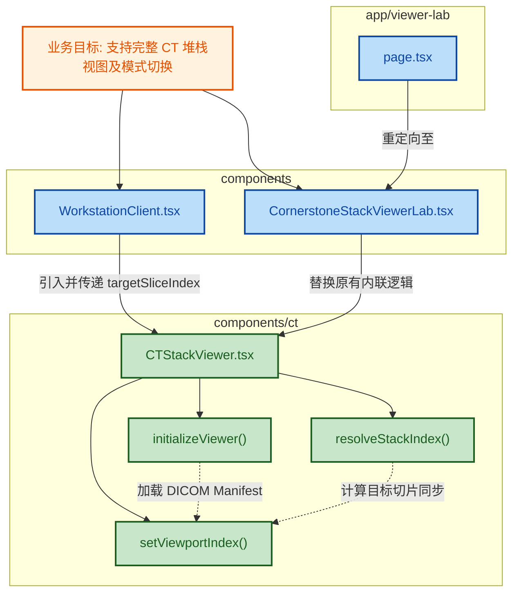

## 1. 高级摘要 (TL;DR)

- **影响程度:** [高] - 将 CT Stack 视图的核心逻辑提取为可复用的独立组件，并在工作站（Workstation）中引入了完整的 CT Stack 预览模式，支持与现有的关键图像（Key Images）工作流进行切换。
- **关键更改:**
  - 📦 **组件提取:** 新建 `CTStackViewer` 组件，封装了 Cornerstone3D 渲染引擎初始化、DICOM Manifest 加载及视图控制逻辑。
  - ✨ **功能集成:** 在 `WorkstationClient` 中新增视图模式切换（`viewerMode`），允许用户在“关键图像”和“完整堆栈（Full Stack beta）”之间无缝切换，并支持切片联动。
  - ♻️ **代码重构:** 大幅简化 `CornerstoneStackViewerLab`，将原有的数百行状态与渲染逻辑替换为简单的 `<CTStackViewer />` 组件调用。
  - 🎨 **样式更新:** 在 `globals.css` 中添加了对应的视图容器、控制面板及紧凑模式（compact）UI 样式。

## 2. 视图与逻辑架构图 (Code & Logic Map)

## 3. 详细变更分析

### 🧱 核心组件提取 (`components/ct/CTStackViewer.tsx`)

- **变更内容:** 从 `CornerstoneStackViewerLab` 中抽离并重构了 Cornerstone3D 栈视图逻辑。引入了全局计数器（`renderingEngineCounter`）以确保多个渲染引擎 ID 的唯一性，允许多个实例共存。新增了通过属性同步外部切片目标的逻辑（例如通过 `targetSliceIndex` 自动跳转）。

**`CTStackViewer` 组件 API 属性:**
| Param | Type | Required | Description |
|---|---|---|---|
| `caseId` | `string` | ✅ | 本地 DICOM API 的病例 ID |
| `compact` | `boolean` | ❌ | 启用紧凑模式的 UI 布局 |
| `height` | `string` | ❌ | 视口的高度（如 `"420px"`） |
| `initialStackIndex` | `number` | ❌ | 初始加载时的栈索引，默认 130 |
| `onStateChange` | `function` | ❌ | 状态变更时的回调事件 |
| `targetSliceIndex` | `number` | ❌ | 外部联动的目标切片索引 |
| `targetSliceMode` | `string` | ❌ | 匹配模式：`"instanceNumber"` 或 `"stackIndex"` |
| `showMetadata` | `boolean` | ❌ | 是否显示 DICOM 元数据面板，默认 true |

### 🖥️ 工作站客户端增强 (`components/WorkstationClient.tsx`)

- **变更内容:** 引入了 `viewerMode` 状态（值域为 `"key-images"` 或 `"full-stack"`）。在界面上新增了视图切换的 Toggle 按钮组。当切换至 `full-stack` 模式时，将渲染带有 `compact` 属性的 `CTStackViewer` 组件。
- **逻辑变更:** 更新了多个 `useEffect` 依赖数组，确保在模式切换时，通过 `selectedFinding?.linkedSliceIndex` 建立发现列表与 CT 堆栈的切片联动。

### 🧪 实验室页面重构 (`components/CornerstoneStackViewerLab.tsx` & `app/viewer-lab/page.tsx`)

- **变更内容:**
  - `CornerstoneStackViewerLab.tsx`: 移除了所有与 Cornerstone 引擎初始化和状态维护相关的硬编码逻辑，替换为对 `<CTStackViewer />` 的调用。
  - `page.tsx`: 新增了实验室入口的路由重定向功能，默认将 `/viewer-lab` 重定向至 `/viewer-lab/ct-stack`。

### 💅 样式支持 (`app/globals.css`)

- **变更内容:** 增加了 `.ct-stack-viewer`, `.ct-stack-controls`, `.ct-stack-metadata-grid` 及相关子元素的样式，特别引入了 `.compact` 紧凑模式修饰符，以优化在工作站面板等较小空间内的排版。

## 4. 影响与风险评估

- ⚠️ **风险点 & 破坏性变更:**
  - 组件在 `useEffect` 清理函数中吞掉了引擎 `destroy()` 抛出的异常（用于规避 React 严格模式或热重载导致的竞态异常）。在大多数场景下无害，但如果用户在前端 SPA 中极高频地来回切换页面，需关注 Cornerstone3D 是否存在底层内存泄漏。
  - 引入全局变量 `renderingEngineCounter` 来生成自增 ID，虽可解决 DOM 冲突，但意味着引擎 ID 将不断增长。
- 🔬 **测试建议:**
  - **模式切换测试:** 在 Workstation 页面中，反复在“Key Images”和“Full Stack beta”之间切换，验证渲染是否正常，控制台是否有 WebGL 或 Cornerstone 初始化报错。
  - **切片联动测试:** 在“Full Stack beta”模式下，点击选中的 Finding（病灶对象），验证 CT 堆栈是否自动跳转（Jump）到对应的 `linkedSliceIndex`。
  - **功能回归测试:** 验证单独的 `/viewer-lab/ct-stack` 页面各项控制（滚轮、拖拽滑块、元数据显示）是否与重构前的行为保持完全一致。
